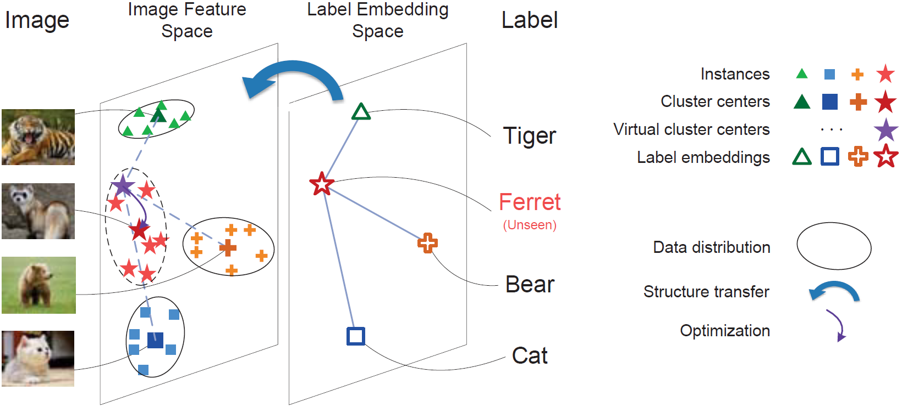
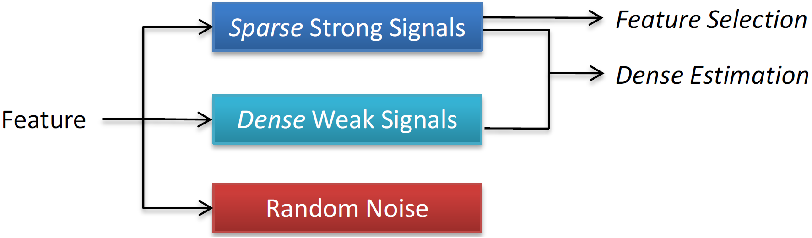
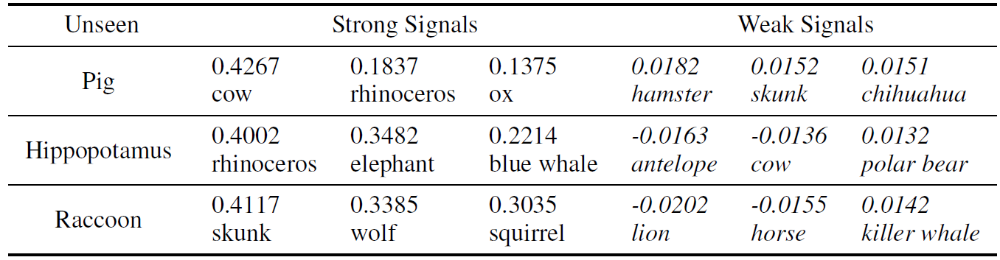
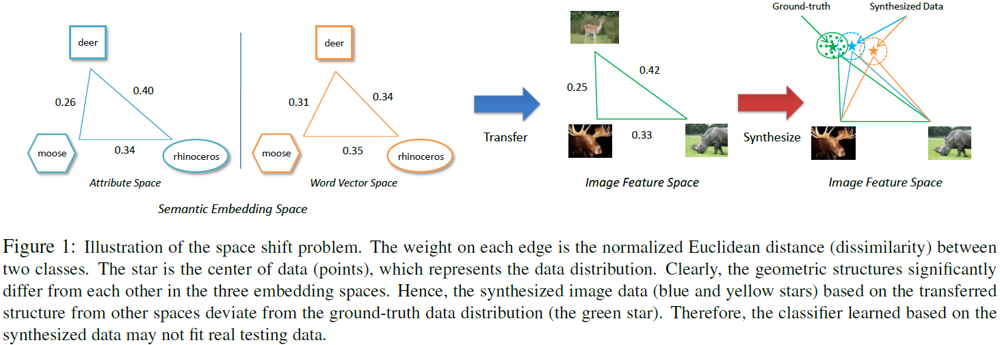
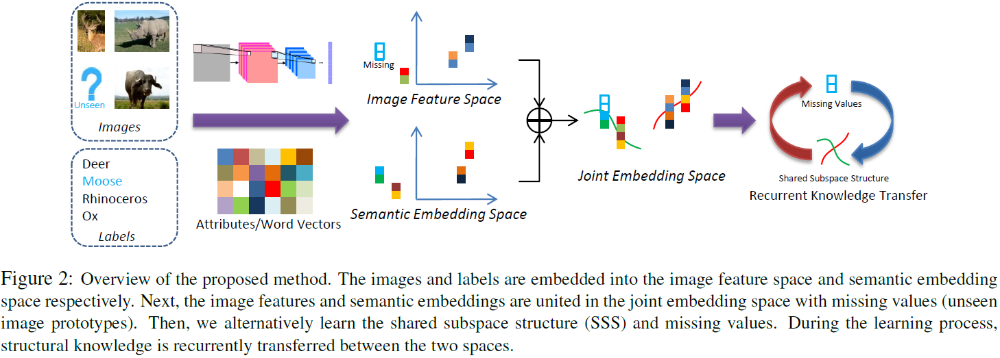
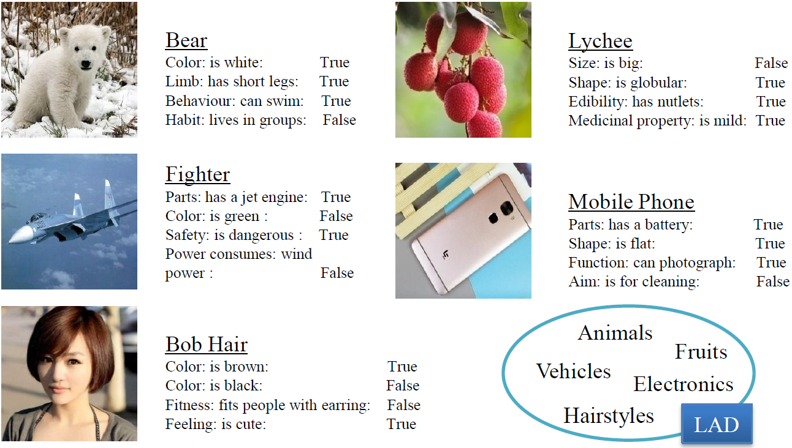

# Zero-shot-Learning
This is a display page of our works on Zero-shot Learning. <br>
Contact: Bo Zhao (bozhaonanjing at Gmail)

Overall, we illustrate 4 papers including an attribute dataset, namely, <br>
[1] Zero-shot learning posed as a missing data problem, ICCVW 2017 <br>
[2] MSplit LBI: Realizing Feature Selection and Dense Estimation Simultaneously in Few-shot and Zero-shot Learning, ICML 2018 <br>
[3] Zero-shot Learning via Recurrent Knowledge Transfer. WACV 2019 <br>
[4] A Large-scale Attribute Dataset for Zero-shot Learning, CVPRW 2019 <br>


## [1] Zero-shot learning posed as a missing data problem <br>
This paper presents a method of zero-shot learning (ZSL) which poses ZSL as the missing data problem, rather than the missing label problem. Specifically, most existing ZSL methods focus on learning mapping functions from the image feature space to the label embedding space. Whereas, the proposed method explores a simple yet effective transductive framework in the reverse way – our method estimates data distribution of unseen classes in the image feature space by transferring knowledge from the label embedding space. Following the transductive setting, we leverage unlabeled data to refine the initial estimation. In experiments, our method achieves the highest classification accuracies on two popular datasets, namely, 96.00% on AwA and 60.24% on CUB.

[Paper Download](http://openaccess.thecvf.com/content_ICCV_2017_workshops/papers/w38/Zhao_Zero-Shot_Learning_Posed_ICCV_2017_paper.pdf)<br>
Code: [Python](https://github.com/AIChallenger/AI_Challenger_2018/tree/master/Baselines/zero_shot_learning_baseline),
[Matlab](https://github.com/PatrickZH/Zero-Shot-Learning-Posed-as-a-Missing-Data-Problem)

 <br>
Figure 1. Illustration of the proposed method. The manifold structure (the straight lines) in the label embedding space is transferred to the image feature space for synthesizing the virtual cluster center (the purple star) of an unseen class. The purple arrow points to a refined cluster center (the red star), which demonstrates that the synthesized virtual cluster center is optimized after running the Expectation-Maximization algorithm so that unseen data are assigned to labels according to the data distribution. <br>

Citation <br>
```
@inproceedings{zhao2017zero,
  title={Zero-shot learning posed as a missing data problem},
  author={Zhao, Bo and Wu, Botong and Wu, Tianfu and Wang, Yizhou},
  booktitle={Computer Vision Workshop (ICCVW), 2017 IEEE International Conference on},
  pages={2616--2622},
  year={2017},
  organization={IEEE}
}
```

## [2] MSplit LBI: Realizing Feature Selection and Dense Estimation Simultaneously in Few-shot and Zero-shot Learning <br>
It is one typical and general topic of learning a good embedding model to efficiently learn the representation coefficients between two spaces/subspaces. To solve this task, L1 regularization is widely used for the pursuit of feature selection and avoiding overfitting, and yet the sparse estimation of features in L1 regularization may cause the underfitting of training data. L2 regularization is also frequently used, but it is a biased estimator. In this paper, we propose the idea that the features consist of three orthogonal parts, namely sparse strong signals, dense weak signals and random noise, in which both strong and weak signals contribute to the fitting of data. To facilitate such novel decomposition, MSplit LBI is for the first time proposed to realize feature selection and dense estimation simultaneously. We provide theoretical and simulational verification that our method exceeds L1 and L2 regularization, and extensive experimental results show that our method achieves state-of-the-art performance in the few-shot and zero-shot learning. <br>
We also visualize the strong and weak signals (i.e. the strongly and weakly related classes) in zero-shot learning experiments.

[Paper Download](https://arxiv.org/pdf/1806.04360.pdf)<br>
[Code](https://github.com/PatrickZH/MSplitLBI)

 <br>
Figure 1. MSplit LBI is learned in linear embedding to decompose the features into sparse strong signals, dense weak signals and random noise. The sparse strong signals facilitate the feature selection. The dense estimation can be done via the sparse strong signals and dense weak signals. <br>
<br>
Table 3. Regression weights of three target domain (unseen) animals on AwA.
<br>

Citation <br>
```
@article{zhao2018msplit,
  title={MSplit LBI: Realizing Feature Selection and Dense Estimation Simultaneously in Few-shot and Zero-shot Learning},
  author={Zhao, Bo and Sun, Xinwei and Fu, Yanwei and Yao, Yuan and Wang, Yizhou},
  journal={Proceedings of the 35th International Conference on Machine Learning},
  year={2018}
}
```

## [3] Zero-shot Learning via Recurrent Knowledge Transfer <br>
Recently, many works implement zero-shot learning by transferring structural knowledge from the semantic embedding space to the image feature space. However, we observe that such direct knowledge transfer may suffer from the space shift problem in the form of the inconsistency of geometric structures in the training and testing spaces. To alleviate this problem, we propose a novel method which actualizes recurrent knowledge transfer (RecKT) between the two spaces. Specifically, we unite the two spaces into the joint embedding space in which unseen image data are missing. The proposed method provides a synthesis-refinement mechanism to learn the shared subspace structure (SSS) and synthesize missing data simultaneously in the joint embedding space. The synthesized unseen image data are utilized to construct the classifier for unseen classes. Experimental results show that our method outperforms the state-of-the-art on three popular datasets. The ablation experiment and visualization of the learning process illustrate how our method can alleviate the space shift problem. By product, our method provides a perspective to interpret the ZSL performance by implementing subspace clustering on the learned SSS.  <br>

[Paper Download](https://drive.google.com/open?id=1cUsQWX80zeCxTyVSCcYlqEWZP-Hq0KzR)<br>
[Code](https://github.com/PatrickZH/Zero-shot-Learning-via-Recurrent-Knowledge-Transfer)<br>

<br>
Figure 1: Illustration of the space shift problem. The weight on each edge is the normalized Euclidean distance (dissimilarity) between two classes. The star is the center of data (points), which represents the data distribution. Clearly, the geometric structures significantly differ from each other in the three embedding spaces. Hence, the synthesized image data (blue and yellow stars) based on the transferred structure from other spaces deviate from the ground-truth data distribution (the green star). Therefore, the classifier learned based on the synthesized data may not fit real testing data. <br>
<br>
Figure 2: Overview of the proposed method. The images and labels are embedded into the image feature space and semantic embedding space respectively. Next, the image features and semantic embeddings are united in the joint embedding space with missing values (unseen image prototypes). Then, we alternatively learn the shared subspace structure (SSS) and missing values. During the learning process, structural knowledge is recurrently transferred between the two spaces. <br>

Citation <br>
```
@article{,
  title={Zero-shot Learning via Recurrent Knowledge Transfer},
  author={Zhao, Bo and Sun, Xinwei and Hong, Xiaopeng and Yao, Yuan and Wang, Yizhou},
  journal={Proceedings of IEEE Winter Conf. on Applications of Computer Vision (WACV)},
  year={2019}
}
```

## [4] A Large-scale Attribute Dataset for Zero-shot Learning <br>
Previous ZSL algorithms are tested on several benchmark datasets annotated with attributes. However, these datasets are defective in terms of the image distribution and attribute diversity. In addition, we argue that the “co-occurrence bias problem” of existing datasets, which is caused by the biased co-occurrence of objects, significantly hinders models from correctly learning the concept. To overcome these problems, we propose a Large-scale Attribute Dataset (LAD). Our dataset has 78,017 images of 5 super-classes, 230 classes. The image number of LAD is larger than the sum of the four most popular attribute datasets. 359 attributes of visual, semantic and subjective properties are defined and annotated in instance-level. We analyze our dataset by conducting both supervised learning and zero-shot learning tasks. Seven state-of-the-art ZSL algorithms are tested on this new dataset. The experimental results reveal the challenge of implementing zero-shot learning on our dataset. <br>
A competition was held based on this dataset. <br>

[Paper Download](https://arxiv.org/pdf/1804.04314v2.pdf)<br>
Data Download from [Google Drive](https://drive.google.com/open?id=1WU2dld1rt5ajWaZqY3YLwLp-6USeQiVG),
from [BaiduYun](https://pan.baidu.com/s/1QpUpNLnUAOK1vhg5Di0qUQ), Password: cwju <br>
[AI Challenger - Zero-shot Learning Competition](https://challenger.ai/competition/zsl2018) <br>
[Project](https://github.com/PatrickZH/A-Large-scale-Attribute-Dataset-for-Zero-shot-Learning)

 <br>
Figure 1. The overview of the proposed LAD dataset. It includes 230 classes belonging to five super-classes (domains). Labels, bounding boxes and attributions are annotated. The upper two attributes are visual attributes, while the bottom two are semantic attributes. <br>

Citation <br>
```
@article{zhao2018large,
  title={A Large-scale Attribute Dataset for Zero-shot Learning},
  author={Zhao, Bo and Fu, Yanwei and Liang, Rui and Wu, Jiahong and Wang, Yonggang and Wang, Yizhou},
  journal={arXiv preprint arXiv:1804.04314},
  year={2018}
}
```
